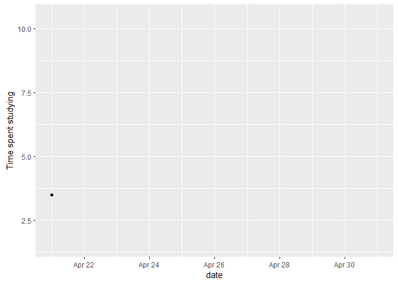

Motivations
===========

My aim in this project was to track how I spent time during the ~2 week
period I recorded my activities. I split my daily activities into 5
categories:  
1. Sleep- All the time spent sleeping.  
2. TV/laptop - Includes all the time I spent watching TV and using my
laptop for entertainment.  
3. Phone - includes periods when I used my phone either for social media
or internet browsing.  
4. Studying - All the time I spent studying.  
5. Social Activities - Times I was involved in physical
interactions/outdoor activities with friends.

Data Collection
===============

I collected data by manually inputting my daily activities on google
calendar.

Results and interpretations.
============================

### Comparing time spent on each activity.

Started by creating boxplots to compare median time spent on activities.
Sleep had the highest median at close to 8.5 hours, followed by
TV/Laptop, Studying, phone and social activities respectively. Boxplots
don’t give the full picture in this context because I undertook some
activities daily, while others only a few days. I therefore made
barplots to compare the total time spent on each activity. I spent the
most time on sleep, followed by studying, phone, TV/Laptop and social
activities respectively.

    my_calendar2 <- my_calendar%>%mutate(date1= as.Date(start))%>%filter(date1>="2020-04-21", summary!="", summary!='Summer Housing Request Meeting')%>%
      select(summary, start, end, length_min, length_hrs)
    ggplot(my_calendar2, aes(x=summary, y=as.numeric(length_hrs), fill = summary)) + 
        geom_boxplot()+
      theme(legend.position="none")+
      labs(x = 'Activities', y = 'length in hours')

    ggplot(my_calendar2, aes(x=summary, y = as.numeric(length_hrs), fill = summary))+
      geom_bar(stat = 'identity')+
          theme(legend.position="none")+
      labs(x = "Activities", y = "Total length in hours")

How the daily time I spent studying changed over time.
------------------------------------------------------

Although time spent studying depended on what day it is, the general
trend is that it increased as the days went by, probably because finals
week was approaching/ end of semester projects.

    my_cal3<- my_calendar2%>%filter(summary == 'Studying')%>%mutate(date = as.Date(start))%>%group_by(date)%>%summarise(daily_study_time = sum(length_hrs))

    plot2<- ggplot(my_cal3, aes(x= date, y=as.numeric(daily_study_time)))+
      geom_line()+geom_point()+ transition_reveal(date)+
      ylab("Time spent studying")

    animate(plot2, 200, fps = 20,renderer = gifski_renderer("line.gif"))

### How often did I socialize and what was the trend?

I did not spend a lot of time engaging in social activities during the
~2 week period. It’s also observable that I spent more time engaging in
social activities during the weekends. There is no clear trend whether
the time I spent socializing went down over time.

    my_cal4<- my_calendar2%>%filter(summary == 'Social Activities')%>%mutate(date = as.Date(start))%>%group_by(date)%>%summarise(daily_social_time = sum(length_hrs))
    ggplot(my_cal4, aes(x= date, y= as.numeric(daily_social_time), fill = as.factor(date)))+
      geom_bar(stat= 'identity', width = 0.4)+
        theme(legend.position="none")+
      ylab("Time spent socializing")

### An animation of how time spent on each activity changed as days went by.

Just a fun visual of how time spent on the different activities
fluctuated over time.

    my_cal5<- my_calendar2%>%mutate(date = as.Date(start))%>%group_by(summary,date)%>%summarise(daily_time = sum(length_hrs))%>%ungroup()
    cal6 <- my_cal5%>%spread(date, daily_time)
    cal6[is.na(cal6)]<-0
    view(cal6)
    cal7<- cal6%>%gather(key = "date", value="dailytime",-summary)

    plot <-ggplot(cal7, aes(x= summary, y= dailytime, fill = summary))+
      geom_bar(stat='identity') 
    anim = plot + transition_states(date, transition_length = 4, state_length = 1)+
          theme(legend.position="none")+
      labs(x= "Activity", y = "length in hrs",title = 'Date : {closest_state}')
    animate(anim, 200, fps = 20,  width = 1200, height = 1000, 
            renderer = gifski_renderer("ggaim2.gif"))

    ## Don't know how to automatically pick scale for object of type difftime. Defaulting to continuous.

Insights
========

From my data and visuals, I figured out that the single activity that
took most of my time was sleep. This is not surprising considering I
regularly sleep 8-9 hours a day. Another interesting thing was how my
studying time evolved. I learnt that I don’t evenly distribute my study
time, and I tend to study more when exams are approaching or when
projects are due. I also figured out my main source of entertainment was
my phone. However the time spent on my phone was almost the same as the
time I spent watching TV or videos on my laptop. The time I spent on
social interactions was minimal, and was concentrated on weekends. This
was mainly due to social distancing regulations that were in place
because of Covid-19. I would have loved to compare how my schedule
during this period differed from my schedule during the normal semester,
but I don’t use google calendar usually.

Reflections
===========

The main issue when dealing with data is data privacy. Whether I am the
one using the data, or someone is using my data, privacy is paramount.
Data scientists should always aim to protect individual’s data and abide
by the stipulated laws. Abiding by privacy laws will make individuals
confident about how their data is handled and will have few concerns
when availing their data for usage/analysis leading to better outcomes
for both parties.
